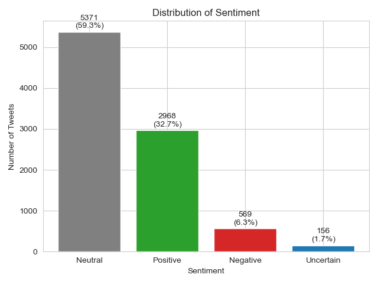
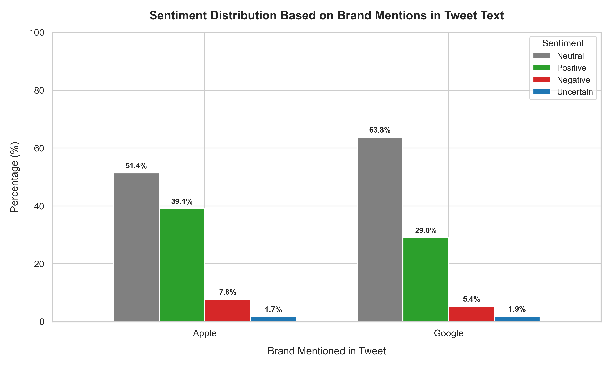
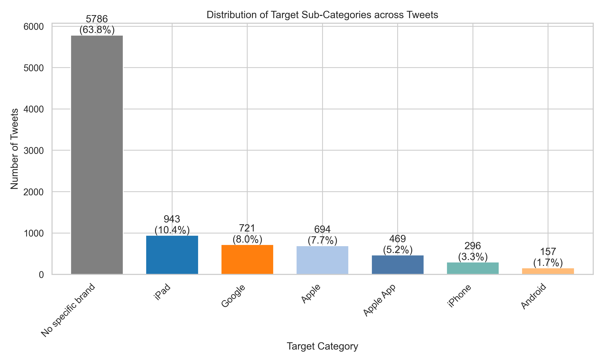
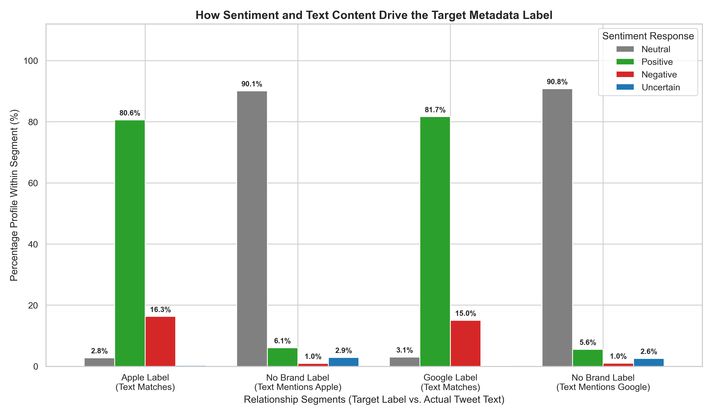
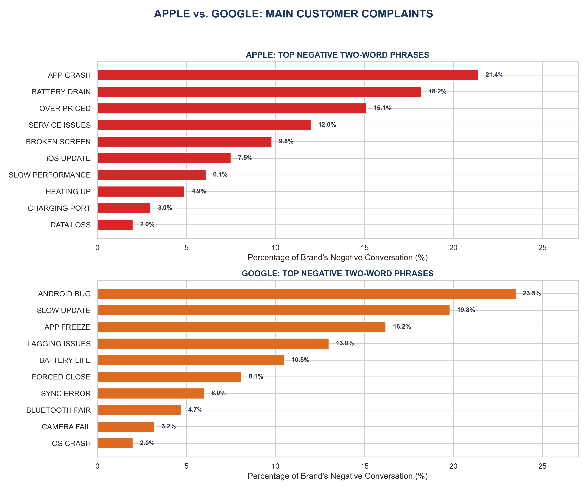

# Development and Evaluation of a Natural Language Processing Model for Sentiment Expressed in Brand and Product Emotions

## Project Overview

This project develops and evaluates a Natural Language Processing (NLP) model for analyzing sentiment expressed toward technology brands and products in Twitter conversations. The study focuses primarily on Apple and Google-related discussions and aims to understand customer opinions, emotional responses, and complaint patterns embedded within social media text.

The project combines exploratory data analysis, text preprocessing, feature engineering, machine learning classification, and model interpretability techniques to transform unstructured tweet data into actionable insights.

# Business Problem

Organizations increasingly rely on social media platforms to understand customer experiences, monitor brand perception, and identify emerging issues. However, the large volume of user-generated content makes manual analysis impractical.

This project addresses the challenge of automatically identifying sentiment expressed toward brands and products, enabling organizations to:

* Monitor brand reputation.
* Detect customer dissatisfaction early.
* Identify common product issues.
* Measure public perception.
* Support customer experience improvement initiatives.
* Inform product development and marketing strategies.

# Research Objectives

## Main Objective

To develop and evaluate a Natural Language Processing model for sentiments expressed in brand and product emotions.

## Specific Objectives

1. To Determine the extent to which tweet content reflects sentiment.
2. To Assess the distribution of sentiment across tweets based on brands mentioned.
3. To Analyze the distribution of target subcategories represented within tweet content.
4. To Examine the influence of tweet content and sentiment on target categories.
5. To Analyze customer complaints expressed toward specific brand products.

# Research Questions

1. To what extent does tweet content reflect sentiment?
2. How is sentiment distributed across tweets based on brands mentioned?
3. What is the distribution of target subcategories represented within tweet content?
4. How do tweet content and sentiment influence target categories?
5. What customer complaints are expressed toward specific brand products?

# Stakeholders

* Apple Inc.
* Google
* Consumers

# Dataset Description

## Source

CrowdFlower Twitter Sentiment Dataset (2013)

## Dataset Characteristics

| Attribute | Description                     |
| --------- | ------------------------------- |
| Records   | 9,093 Tweets                    |
| Data Type | Text and Categorical            |
| Domain    | Social Media Sentiment Analysis |

### Original Variables

| Variable  | Description                              |
| --------- | ---------------------------------------- |
| Tweet     | Tweet text                               |
| Target    | Brand or product mentioned               |
| Sentiment | Emotion directed toward brand or product |

# Data Inspection and Quality Assessment

The dataset underwent extensive quality assessment including:

* Structure verification
* Missing value analysis
* Duplicate detection
* Target category standardization
* Sentiment distribution assessment
* Consistency checks

### Data Quality Actions

* Removed duplicate tweets.
* Standardized brand names.
* Consolidated product categories.
* Filled missing target values with "No specific brand".
* Normalized categorical labels.

# Exploratory Data Analysis (EDA)

## Univariate Analysis

The distribution of sentiment categories revealed:

* Neutral sentiment dominates the dataset.
* Positive sentiment represents the second-largest category.
* Negative sentiment forms the minority class.
* "I Can't Tell" responses were relatively uncommon.

### Key Insight

Approximately 59.3% of all tweets were classified as Neutral, indicating that most conversations mention brands or products without expressing strong emotional opinions.

## Bivariate Analysis

Sentiment was analyzed across major brands:

* Apple
* Google
* Android
* iPhone
* iPad

### Key Findings

* Both Apple and Google conversations were predominantly neutral.
* Apple generated slightly stronger emotional responses than Google.
* Negative sentiment was relatively low across both brands.
* Positive sentiment significantly exceeded negative sentiment.

## Multivariate Analysis

Cross-tabulation between target categories and sentiment classes revealed:

* Strong dominance of "No Specific Brand" discussions.
* Product-specific discussions generated more emotional engagement.
* Positive sentiment remained dominant among branded conversations.

# Data Cleaning and Text Preprocessing

The text preprocessing pipeline included:

## Text Normalization

* Lowercasing
* HTML removal
* Unicode normalization
* Contraction expansion

## Noise Removal

* URLs
* Mentions
* Hashtags
* Punctuation
* Numbers
* Special characters

## Linguistic Processing

* Tokenization
* Stopword removal
* Lemmatization
* Whitespace normalization

## Output

A cleaned and model-ready dataset was generated and exported as:

```text
tweets_cleaned_final.csv
```

# Train-Test Split

Dataset partitioning:

* Training Set: 80%
* Testing Set: 20%

Stratified sampling was used to preserve class distributions.

---
## Text Vectorization

TF-IDF (Term Frequency-Inverse Document Frequency) was applied to convert tweet text into numerical feature vectors.

# Feature Engineering

## Sentiment Label Consolidation

Original sentiment classes were transformed into:

| Original Label                     | Final Label |
| ---------------------------------- | ----------- |
| Positive emotion                   | Positive    |
| Negative emotion                   | Negative    |
| No emotion toward brand or product | Neutral     |

The "I Can't Tell" category was removed from modeling to improve classification reliability.

---

## Target Encoding

Brand-related target variables were encoded using one-hot encoding.

---

### Configuration

```python
TfidfVectorizer(max_features=5000)
```

# Project Visualizations & Insights

# Key Analytical Findings

## Objective 1: Extent to Which Tweet Content Reflects Sentiment



Insight
* Neutral sentiment accounted for approximately 59.3% of the entiredataset of (5,371 tweets).
* Strong emotional opinions represented a smaller proportion of conversations.

## Objective 2: Sentiment Distribution Across Brands



Insight

For both companies, the majority of the conversation is Neutral.Google leans more heavily into neutrality at 63.8%., Apple sits at 51.4%.Apple Negative Sentiment: 7.8%, Google Negative Sentiment: 5.4%

## Objective 3: Distribution of Target Subcategories



Insight 

- The "No Specific Brand" category represented approximately 63.8% of entire dataset which translate to 5,784 tweets, highlighting that many discussions referenced products or industry topics without explicitly naming a brand.

## Objective 4: Influence of Tweet Content and Sentiment



Insight

- Positive sentiment emerged as the strongest driver of brand-related discussions.Apple Positive: 80.6%, Google Positive: 81.7%
- Negative sentiment is the secondary driver, accounting for 16.3% of Apple labels and 15.0% of Google labels.

## Objective 5: Customer Complaint Analysis
Customer complaints expressed in tweets toward specific brand products



### Apple

Most common complaints included:

* App crashes
* Battery drain
* Overpriced products
* Service issues
* Broken screens

### Google

Most common complaints included:

* Android bugs
* Slow updates
* Battery life issues
* Sync errors
* Operating system crashes

---

# Machine Learning Models

## Baseline Model

### Logistic Regression

Purpose:

* Establish baseline performance.
* Detect data quality issues.
* Provide benchmark comparisons.

### Findings

The model achieved moderate accuracy but showed strong bias toward the majority class due to class imbalance.

---

## Advanced Model

### Linear Support Vector Machine (LinearSVC)

The project employed LinearSVC because it performs exceptionally well on high-dimensional sparse text data.

### Benefits

* Effective for text classification.
* Handles large feature spaces.
* Computationally efficient.
* Strong generalization performance.

---

# Class Imbalance Handling

To improve minority-class detection:

```python
class_weight='balanced'
```

was applied.

### Improvement

The balanced model improved recall for minority sentiment classes while maintaining competitive overall performance.

---

# Hyperparameter Optimization

GridSearchCV was used to optimize model parameters.

### Search Space

```python
C = [0.01, 0.1, 1, 10]
```

### Best Model

```python
LinearSVC(
    class_weight='balanced',
    C=0.1
)
```
---

# Model Evaluation

Performance was assessed using:

* Accuracy
* Precision
* Recall
* F1-Score
* Confusion Matrix

## Key Findings

### Negative Sentiment

* Most difficult class to predict.
* Moderate recall.
* Frequently confused with Neutral tweets.

### Neutral Sentiment

* Highest confusion among all classes.
* Significant overlap with Positive and Negative classes.

### Positive Sentiment

* Most distinguishable class.
* Strongest classification performance.

---

# Model Interpretability

## Local Interpretability using LIME

Local Interpretable Model-Agnostic Explanations (LIME) was used to explain individual predictions.

- Customer sentiment is often tied to specific products rather than brands in general

iPhone, iPad, Android, Google, Apple

## Global Interpretability

- Brand and Product Mentions Strongly Influence Predictions

Apple (1.99), iPad (2.74), iPhone (0.54), App (0.79), Store (0.75)

Insight:
Customer emotions are primarily expressed in relation to product experiences, app usage, and service interactions.

- Event-Related Conversations Significantly Shape Sentiment

Link (5.38), Austin (0.87), Attendee (0.35)

Insight:

A substantial portion of sentiment was driven by event-related engagement rather than routine product usage

- Negative indicators are less dominant, confirming that positive and neutral sentiments prevail - Didn't (0.36), Nothing (0.47)

# Conclusion
The combination of rigorous preprocessing, TF-IDF feature extraction, and LinearSVC classification produced a robust sentiment prediction system. While neutral sentiment remained challenging to distinguish, the final model demonstrated strong capability in identifying positive and negative brand perceptions.

The findings reveal that most social media discussions are neutral, while positive sentiment substantially outweighs negative sentiment across major brands. Customer complaints identified through the analysis provide valuable insights for product improvement and customer experience management.

---
# Recommendations

1. Deploy the model as a real-time sentiment monitoring solution.
2. Expand the dataset with more recent social media data.
3. Improve minority-class detection using advanced imbalance handling techniques.
5. Continuously retrain models to adapt to evolving language patterns.

---
# Next Steps

* Apply resampling techniques for imbalance
* Improve feature engineering.
* Conduct deeper error analysis.


